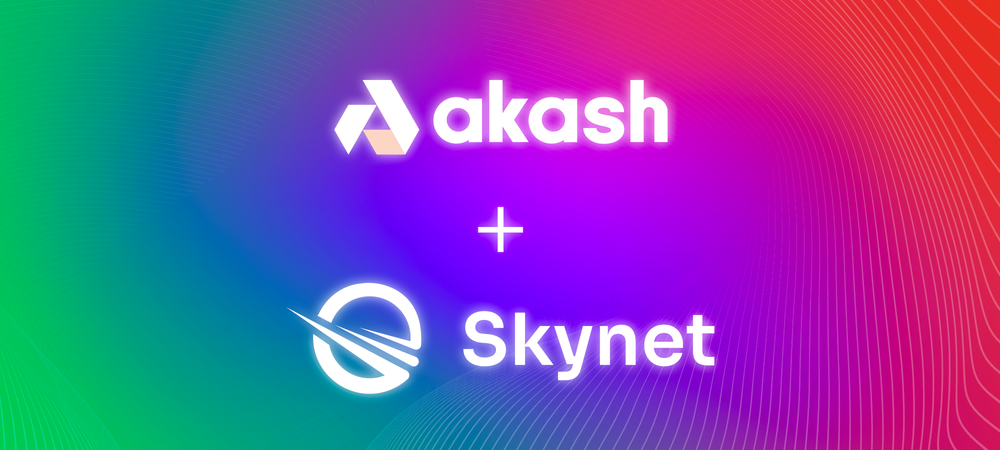

**SAN FRANCISCO, California, June 28, 2021** — Akash Network, the open-source and decentralized cloud (DeCloud) also known as Airbnb for cloud computing, today announced a key integration with Skynet Labs, the team behind Sia, a decentralized storage network. By bringing together compute and storage layers, Akash Network and Skynet are now enabling developers to host their applications on a fully decentralized cloud.

Akash Network’s DeCloud is differentiated by its speed of deployment, flexibility, lower cost, and permissionless access. Now with Skynet as a key technology partner, Akash’s solution can integrate storage and compute resources. Akash will be able to leverage Skynet’s decentralized storage to backup and restore server instances, host larger volumes of data, and distribute files across multiple points of presence, ultimately improving the user experience. With this integration, Akash Network and Skynet can provide a full-stack solution that will handle backup, restore, and migration for databases running on the DeCloud.

“The full-stack solution for the decentralized web is now a reality, with Skynet as the front-end with storage, and Akash as the back-end API and database host,” said Greg Osuri, CEO of Akash Network. “Each step of this partnership has been supported and developed by the community, and began with a challenge on Twitter to combine Akash, Skynet, and Handshake into a single open-source package. We plan to support these efforts long-term through community-targeted funding.” The materialization of dWeb is a major shift away from computing resources being owned and operated by the three large centralized cloud software giants. Technology is now poised to shift away from Amazon Web Services (AWS), Google Cloud, and Microsoft Azure, to a decentralized network of cloud providers operating open-source software platforms and creating healthy market competition in an open marketplace with more providers and lower costs.

“The world of decentralized computing has seen major advancements in the past 10 years. The things we are able to accomplish today put decentralized infrastructure ahead of traditional architectures by achieving similar performance at lower cost and higher reliability,” said David Vorick, CEO of Skynet. “The real advantage, however, is the political stability - the terms of service and available APIs of centralized services change every day, but decentralization comes with guarantees. The entrepreneurs of tomorrow will build on decentralized tech, because it gives them so much more control over the future of their business.”

## About Akash Network

Akash Network, the world’s first decentralized and open-source cloud, accelerates deployment, scale, efficiency and price performance for high-growth industries like blockchain and machine learning/AI. Known as the "Airbnb for Cloud Compute”, Akash Network provides a fast, efficient and low-cost application deployment solution. Developers leveraging Akash Network can access cloud computing at up to three times less than the cost of centralized cloud providers like Amazon Web Services, Google Cloud and Microsoft Azure. Utilizing containerization and open-source technology, Akash Network leverages 85% of underutilized cloud capacity in 8.4 million global data centers, enabling anyone to buy and sell cloud computing. For more information visit: [https://akash.network/](https://akash.network/).

## About Skynet Labs

Skynet Labs builds uncompromising software infrastructure for the decentralized internet. This includes Sia, the leading decentralized cloud storage platform and Skynet, a content hosting and application development platform. Skynet Labs defines uncompromising infrastructure as scalable, trustless, secure, and most importantly, fully decentralized. Skynet Labs stands out as one of the few deeply technical teams that consistently deliver real products with significant potential. Learn more at [siasky.net](https://siasky.net/), join us on [Discord](https://discord.gg/skynetlabs), and email us at hello@sia.tech.
